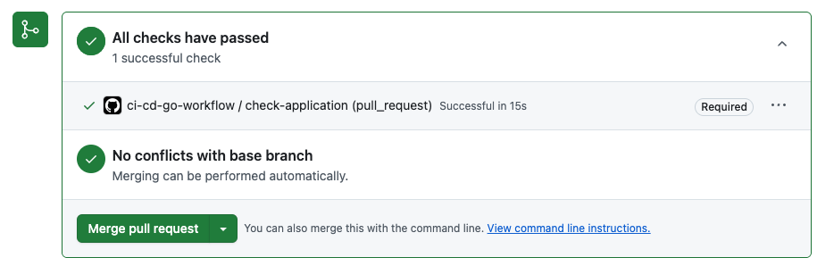

# Operações matemáticas utilizando GO, CI-CD com Docker
Exemplo de implementação das operações matemáticas utilizando Go Lang, com integração contínua utilizando Docker

## Processos de desenvolvimento

### Objetivo geral
- Utilização de actions do github para realizar CI/CD com Dockerfile para criação de imagem e container;

### Objetivos especificos
- Trabalhar com um branch develop protegido;
- Subir alterações em branchs específicos e fazer pull request e merge para o branch develop;
- Utilização de Docker para criação de imagem e container;
- Utilização de Github Actions para CI/CD;

### Passo 1 - Criar as operações
- Criação das operações de adição, subtração, multiplicação e divisão;
- Inicialização do modulo go: `go mod init calculator`;
- Baixar as dependências: `go mod tidy`;
- Executar as operações: `go run cmd/main.go`;

### Passo 2 - Criar teste de unidade das operações
- Criação dos testes de unidade para as operações de adição, subtração, multiplicação e divisão;
- Executar os testes: `go test ./...`;

### Passo 3 - Criar o arquivo .github/workflows/ci.yaml
- Criação do arquivo ".github/workflows/ci.yaml" para realizar a CI/CD;
- Neste passo, somente será executado o teste de unidade das operações no evento push do branch main;
```yaml
name: ci-cd-go-workflow
on: [push]
jobs:
  check-application:
    runs-on: ubuntu-latest
    steps:
      - uses: actions/checkout@v2
      - uses: actions/setup-go@v2
        with:
          go-version: '1.19'
      - run: go test ./...
```

### Passo 4 - Alterar o branch default do repositório
- Adicionar novo branch develop: `git checkout -b develop`;
- Efetuar o push do branch develop: `git push origin develop`;
- No github, nas configurações (Settings -> General) do repositório, alterar "Default branch"  para develop;

### Passo 5 - Adicionar proteção no branch develop
- Adicionar (Settings -> Branches -> Branch protection rules) uma role de proteção para o branch "develop", e marcar as opções "Require status checks to pass before merging", "Require branches to be up to date before merging" e "Do not allow bypassing the above settings". Adicionar "check-application" como status check;

### Passo 6 - Alterar o arquivo "ci.yaml" para executar o evento somente no "pull request" no branch "develop"
```yaml
on:
    pull_request:
      branches:
        - develop
```
- Após alterar o arquivo "ci.yaml", será feito o commit e um push para o branch develop: `git push origin develop`;
- Ao executar o comando push, será retornado o seguinte erro:
```shell
remote: error: GH006: Protected branch update failed for refs/heads/develop.
remote: 
remote: - Required status check "check-application" is expected.
To https://github.com/rodrigodittrich/calculator-ci-cd-go-docker.git
 ! [remote rejected] develop -> develop (protected branch hook declined)
error: failed to push some refs to 'https://github.com/rodrigodittrich/calculator-ci-cd-go-docker.git'
```

Este erro ocorreu porque foi adicionada uma proteção no branch "develop" para não fazer push diretamente no branch.

### Passo 7 - Pull Request
- 1 - Vamos criar uma branch para a alteração feita no passo 6: `git checkout -b feature/ci-cd`;
- 2 - Vamos fazer o push no branch feature/ci-cd: `git push origin feature/ci-cd`;
- 3 - Vamos criar um "pull request" para o branch "develop" no github;


- 4 - Após o pull request ser aprovado, o branch "feature/ci-cd" será mesclado no branch "develop";

- 5 - Após fazer o merge no github para o branch "develop", vamos voltar para o branch "develop" localmente: `git checkout develop`;
- 6 - Após voltar para o branch "develop", vamos fazer o pull do branch "develop" no github: `git pull origin develop`;
- 7 - (Opcional) Após a mesclagem, podemos deletar o branch "feature/ci-cd" no github e localmente: `git branch -d feature/ci-cd`;

### Passo 8 - Docker
[Build and push Docker images](https://github.com/marketplace/actions/build-and-push-docker-images)
- Criar o arquivo Dockerfile;
- Criar um novo branch feature/ci-cd-docker-build: `git checkout -b feature/ci-cd-docker-build`
- Fazer o commit e push do Dockerfile;
- Fazer o pull request no github para o branch develop;
- Fazer o merge no github para o branch develop;
- No ambiente de desenvolvimento, voltar para o brach develop: `git checkout develop`
- Fazer pull do branch develop: `git pull origin develop`

### Testar o Dockerfile antes de subir para o repositório:
- Criar imagem: `docker build -t calculator .`
- Executar container: `docker run -it --rm calculator`

### Passo 9 - Alterar arquivo "ci.yaml" para build com Docker
- Adicione ao arquivo "ci.yaml" existente o bloco abaixo:
```yaml
      - name: Set up QEMU
        uses: docker/setup-qemu-action@v1

      - name: Set up Docker Build
        uses: docker/setup-buildx-action@v1

      - name: Build and push
        id: docker_build
        uses: docker/build-push-action@v2
        with:
          push: false
          tags: rodrigodittrich/ci-cd-go-calculator:latest   
```
- Criar um novo branch feature/ci-cd-docker-build-ci: `git checkout -b feature/ci-cd-docker-build-ci`
- Fazer commit e push no branch feature/ci-cd-docker-build-ci: `git push origin feature/ci-cd-docker-build-ci`
- Fazer o pull request no github para o branch develop;
- No ambiente de desenvolvimento, voltar para o brach develop: `git checkout develop`
- Fazer pull do branch develop: `git pull origin develop`

### Passo 10 - Fazer o push da imagem no docker hub
- Na sua conta do github, nas configurações(Settings -> Security -> Secrets as variables -> Actions -> Repository secrets), adicionar usuário o token do docker hub.
- Alterar o "ci.yaml" para fazer login no docker hub e fazer push da imagem;
- Criar um novo branch feature/ci-cd-docker-push: `git checkout -b feature/ci-cd-docker-push`
- Fazer commit e push no branch feature/ci-cd-docker-push: `git push origin feature/ci-cd-docker-push`

### Passo 11 - Deixar o ambiente local atualizado no branch develop
- No ambiente de desenvolvimento, voltar para o brach develop: `git checkout develop`
- Fazer pull do branch develop: `git pull origin develop`
- (Opcional) Deletar o branch local feature/ci-cd-docker-push: `git branch -d feature/ci-cd-docker-push`

### Resultado final
O resultado final é a execução completa do job fazendo o push da imagem para o docker hub
- Job:

- Docker Hub:


### Testar imagem no docker hub
- Testar imagem do docker hub: `docker run -it --rm --platform linux/amd64 rodrigodittrich/ci-cd-go-calculator`
- Forçar se a plataforma é arm64: `docker run -it --rm --platform linux/arm64 rodrigodittrich/ci-cd-go-calculator`